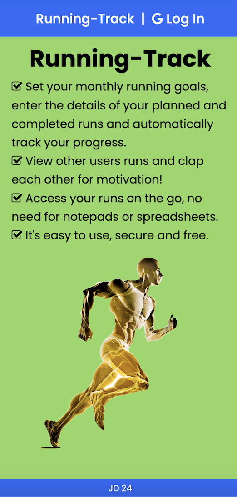
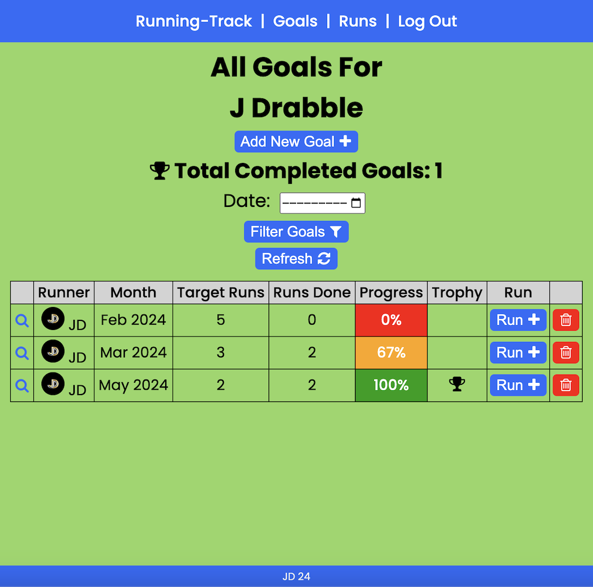

## Running-Track

An application to set your running goals, enter the details of your runs and automatically display your goal progress.

## Application Description/Objective

Set your monthly running goals, enter the details of your planned and completed runs and automatically track your progress. View other users runs and clap each other for motivation! Access your runs on the go, no need for notepads or spreadsheets. It's easy to use, secure and free.

## Background

The application is aimed at novice runners and runners that do not want GPS tracking or detailed statistics, but are simply aiming to complete a target number of monthly runs. The application is simple to use and will help runners stay motivated and develop a running habit.

## Getting Started

Log in using Google OAuth to create your account. Create some monthly running goals and enter the details of your planned and completed runs. You can edit and delete your goals and runs if necessary.

[Running-Track](https://running-track.onrender.com/)

[Fitness PNGs by Vecteezy](https://www.vecteezy.com/free-png/fitness)

## User Stories

- As a user I want to be able to log in and out.
- As a user I want only logged in users to be able to use the application, and be able to go further than the home page.
- As a user I want users to be redirected to the home page if they try to access an a page or record they are not permitted to view.
- As a user I want to be able to easily navigate pages and between pages.
- As a user I want to be able to create my monthly running goals.
- As a user I want to be prevented from creating duplicate running goals.
- As a user I want to be able to edit my monthly goal target.
- As a user I want to be able to delete my monthly goals.
- As a user I to be the only user that can create, read, edit and delete my monthly goals.
- As a user I want to be able to see all my monthly goals together, in date order, and filter them.
- As a user I want to see how I am progressing against my monthly goals, versus completed runs, as a percentage, along with color coding (red for below 50% of taget, amber for 50-99%, green for 100% and above) and planned runs are not to count towards the goal target.
- As a user I want to be able to see how many goals I have completed by month and in total.
- As a user I want to be rewarded with a trophy when I achieve my monthly goal.
- As a user I want my monthly goal progress to be automatically updated to include all my relevant completed monthly runs that occurred before the monthly goal was set up - for example, if a goal is created part way through a month.
- As a user I want to be able to create planned and completed runs that are linked to my corresponding monthly goal.
- As a user I want my average running speed to automatically be calculated and displayed.
- As a user I want to be able to edit all details of my runs, but not be able to change the run date to a different month and year to that of the linked goal month and year.
- As a user I want to be able to delete my runs.
- As a user I want to be the only user that can edit and delete my runs.
- As a user I want to be able to see all my runs together, in date order, and filter them with multiple filters.
- As a user I want to be able to see total competed run distance and time by date and in total and by user.
- As a user I want to be able to see all other users runs together (only) and be able to filter them.
- As a user I want other users to be able to clap my planned and completed runs, but not be able to clap my own runs.
- As a users I should only be able to clap each run once and should be able to remove a clap (and the clap button should change color depending on if it has been clapped or not by the user).
- As a user I want forms to be populated with values from my records and validation warnings to show on the page in red text if a mistake is made.
- As a user I want the application to look simple and be intuitive to use, with clear icons and not much text.
- As a user I want the application to be well laid out and responsive and render well on different screen sizes.

## Trello

[Trello](https://trello.com/b/Dv6igvoO/running-track)

## ERD

## Wireframe

## Technologies

- HTML
- CSS (esp. flexbox and media queries)
- Font Awesome
- JavaScript
- Node and Express
- MongoDB and Mongoose
- Dayjs
- Passport
- Google OAuth

## Future Developments

- Profile Page
- Notifications
- Connect with other users
- More date, distance and duration options
